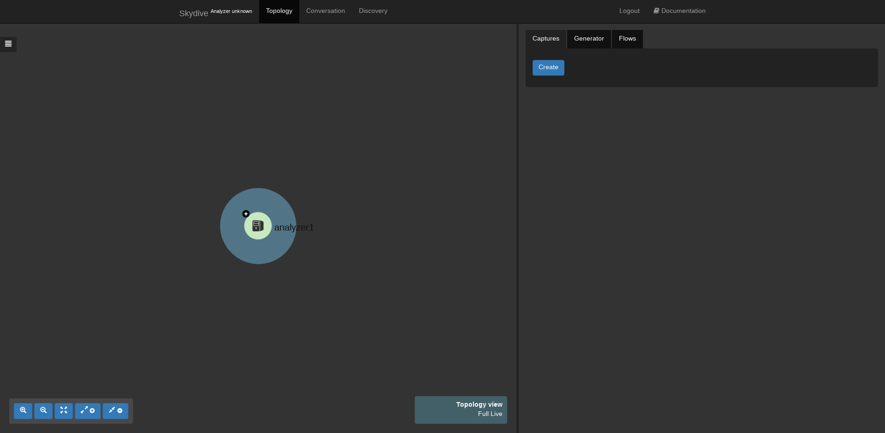

For this first article we will see how it is easy to start Skydive and how to explore the topology thanks to the WebUI and the command line.
<h2>Let's start it</h2>

  Skydive comes as a single binary which includes the Analyzer part, the Agent part and the client. Here we are going to use the `allinone` mode of Skydive which
  starts everything for us. There are many way to deploy Skydive but here as we going to use it for testing purpose we are going to use to easiest one which
  is simply to download the static binary.

  <code> 
    $ curl -Lo skydive https://github.com/skydive-project/skydive-binaries/raw/jenkins-builds/skydive-latest && chmod +x skydive && sudo mv skydive /usr/local/bin/
     
    $ SKYDIVE_ETCD_DATA_DIR=/tmp sudo -E /usr/local/bin/skydive allinone
  </code>

  The `SKYDIVE_ETCD_DATA_DIR` variable is just there to specify where the embedded Etcd will store its data.

<h2>Discover the WebUI</h2>

  Skydive is now started and its WebUI is available through the port 8082, so pointing your web browser to `http://localhost:8082` you will something
  similar to this :

  

  The following video shows basic interaction with the WebUI, interface metadata exploration like the `Neighbors`, the 'Routing tables', etc.

  <video id="nsc_stream_video" poster="" preload="" controls="" autoplay="" loop="" controlslist="nodownload" src="assets/videos/first-steps/getting-started.webm"></video>

